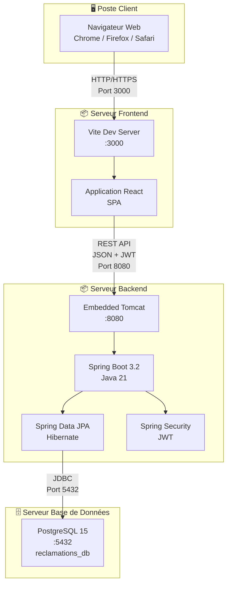
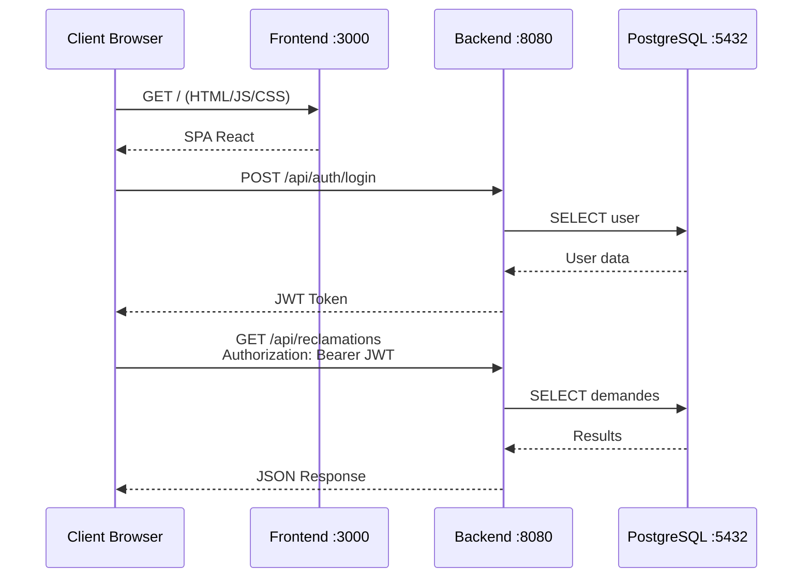
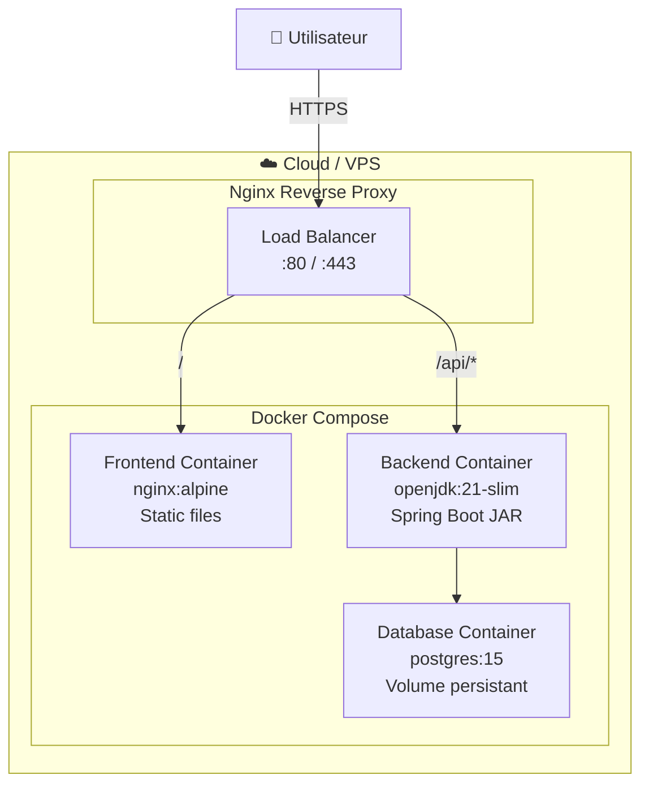

# Diagramme de Déploiement — Application Réclamation IBAM

## Architecture de Déploiement

---

## Composants Déployés

### 🖥️ Poste Client
| Composant | Technologie |
|-----------|-------------|
| Navigateur | Chrome, Firefox, Safari |
| Protocole | HTTP/HTTPS |

### 📦 Nœud Frontend (Node.js)
| Composant | Technologie | Port |
|-----------|-------------|------|
| Serveur de développement | Vite 5.4 | 3000 |
| Application | React 18 + React Router | - |
| HTTP Client | Axios | - |

### 📦 Nœud Backend (JVM)
| Composant | Technologie | Port |
|-----------|-------------|------|
| Serveur d'application | Embedded Tomcat | 8080 |
| Framework | Spring Boot 3.2 | - |
| ORM | Hibernate / JPA | - |
| Sécurité | Spring Security + JWT | - |
| Runtime | Java 21 (LTS) | - |

### 🗄️ Nœud Base de Données
| Composant | Technologie | Port |
|-----------|-------------|------|
| SGBD | PostgreSQL 15 | 5432 |
| Base | reclamations_db | - |

---

## Communication entre Nœuds

---

## Déploiement Production (Recommandé)

---

## Artefacts de Déploiement

| Artefact | Type | Commande |
|----------|------|----------|
| `frontend/dist/` | Static files | `npm run build` |
| `reclamation-0.0.1-SNAPSHOT.jar` | Fat JAR | `./mvnw package` |
| `docker-compose.yml` | Stack complète | `docker-compose up` |
